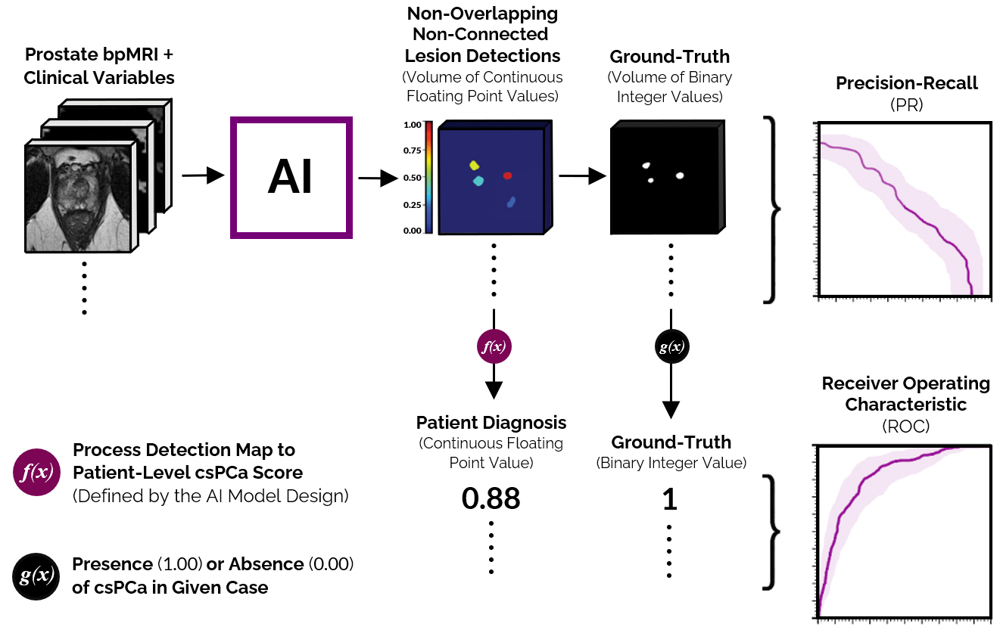

# Evaluation Utilities for 3D Detection and Diagnosis in Medical Imaging


This repository contains standardized functions to evaluate 3D detection and diagnosis performance in medical imaging —with its evaluation strategy being geared towards clinically significant prostate cancer (csPCa) detection in MRI. It is used for the official evaluation pipeline of the [PI-CAI challenge](https://pi-cai.grand-challenge.org/).

## Supported Evaluation Metrics
- **Average Precision (AP)**
- **Area Under the Receiver Operating Characteristic curve (AUROC)**
- **Overall AI Ranking Metric of the [PI-CAI challenge](https://pi-cai.grand-challenge.org/): `(AUROC + AP) / 2`**
- **Precision-Recall (PR) curve**
- **Receiver Operating Characteristic (ROC) curve**
- **Free-Response Receiver Operating Characteristic (FROC) curve**

## Additional Supported Functionalities
- **Subset Analysis**: By providing a list of case identifiers, performance can be evaluated for only that specific subset.
- **Case-Wise Sample Weighting**: Sample weighting can help facilitate [inverse probability weighting](https://www.bmj.com/content/352/bmj.i189). Note, when this feature is used in conjunction with lesion-level evaluation, the same weight is applied to all lesion candidates of the same case. Lesion-wise sample weighting is currently not supported.
- **Statistical Tests**: Permutation tests and bootstrapping techniques to facilitate AI vs AI/radiologists comparisons in the [PI-CAI challenge](https://pi-cai.grand-challenge.org/).

## Installation
`picai_eval` is pip-installable:

`pip install picai_eval`

## Evaluation Pipeline

_Figure: Detection/diagnosis evaluation pipeline of the [PI-CAI challenge](https://pi-cai.grand-challenge.org/). (top) Lesion-level csPCa detection (modeled by 'AI'): For a given patient case, using the bpMRI exam, predict a 3D detection map of non-overlapping, non-connected csPCa lesions (with the same dimensions and resolution as the T2W image). For each predicted lesion, all voxels must comprise a single floating point value between 0-1, representing that lesion’s likelihood of harboring csPCa. (bottom) Patient-level csPCa diagnosis (modeled by 'f(x)'): For a given patient case, using the predicted csPCa lesion detection map, compute a single floating point value between 0-1, representing that patient’s overall likelihood of harboring csPCa. For instance, f(x) can simply be a function that takes the maximum of the csPCa lesion detection map, or it can be a more complex heuristic (defined by the AI developer)._


## Usage

### Expected Predictions and Annotations
Our evaluation pipeline expects **detection maps** and **annotations** in the following format:
- **Detection Maps**: 3D volumes with non-connected, non-overlapping lesion detections. Each lesion detection is a connected component (in 3D) with the same _confidence or likelihood score_ (floating point) per voxel. Each detection map may contain an arbitrary number of such lesion detections.

- **Annotations**: 3D volumes of the same shape as their corresponding detection maps, with non-connected, non-overlapping ground-truth lesions. Each ground-truth lesion is a connected component (in 3D) with the integer value 1 per voxel. Background voxels are represented by the integer value 0.

Note, we define a _connected component_ as all non-zero voxels with _squared connectivity_ equal to three. This means that in a 3×3×3 neighbourhood all voxels are connected to the centre voxel. See [26-Connectivity](https://en.wikipedia.org/wiki/Pixel_connectivity) for an illustration.

#

### Evaluate Detection Maps with Python
To run evaluation scripts from Python, import the `evaluate` function and provide detection maps (`y_det`) and annotations (`y_true`):

```python
from picai_eval import evaluate

subject_list = [
    "case-0",
    "case-1",
    "case-2",
]

metrics = evaluate(
    y_det=y_det,
    y_true=y_true,
    subject_list=subject_list,  # optional
)
```

- `y_det`: Iterable of all detection maps to evaluate. Each detection map is a 3D volume with non-connected, non-overlapping lesion detections. Each lesion detection is a connected component (in 3D) with the same _confidence or likelihood score_ per voxel. Each detection map may contain an arbitrary number of such lesion detections. Alternatively, `y_det` may contain filenames of detection maps ending in `.nii.gz`/`.mha`/`.mhd`/`.npy`/`.npz`, which will be loaded on-the-fly.

- `y_true`: Iterable of all ground-truth annotations. Each annotation should be a 3D volume of the same shape as its corresponding detection map, with non-connected, non-overlapping ground-truth lesions. `1` is used to encode ground-truth lesions, and `0` is to encode the background. Alternatively, `y_true` may contain filenames of binary annotations ending in `.nii.gz`/`.mha`/`.mhd`/`.npy`/`.npz`, which will be loaded on-the-fly. 

Default parameters will perform evaluation as per the specifications of the [PI-CAI challenge](https://pi-cai.grand-challenge.org/). Optionally, the specifications for evaluation can be adapted using the following parameters:

- `sample_weight`: Case-level sample weight. When this feature is used in conjunction with lesion-level evaluation, the same weight is applied to all lesion candidates of the same case. Default: equal weight for all cases.

- `subject_list`: List of sample identifiers, to give recognizable names to the evaluation results.

- `min_overlap`: Defines the threshold of the hit criterion, i.e. the minimal required Intersection over Union (IoU) or Dice similarity coefficient (DSC) between predicted lesion candidates and ground-truth lesions, for predicted lesions to be counted as true positive detections. Default: 0.1.

- `overlap_func`: Function used to calculate the basis of the hit criterion, i.e. the object overlap between predicted lesion candidates and ground-truth lesions. This can be set as 'IoU' to use Intersection over Union, or 'DSC' to use Dice similarity coefficient. Alternatively, any other function can also be provided with the signature `func(detection_map, annotation) -> overlap [0, 1]`. Default: 'IoU'.

- `case_confidence_func`: Function used to derive case-level prediction or confidence, from lesion-level detections or confidences (as denoted by 'f(x)' in ['Evaluation Pipeline'](#evaluation-pipeline). Default: 'max' (which simply takes the maximum of the detection map, as the case-level prediction).

- `multiple_lesion_candidates_selection_criteria`: Used to account for [split-merge scenarios](https://www.nature.com/articles/s41598-020-64803-w/figures/1). When multiple lesion candidates have sufficient overlap with the ground-truth lesion, this condition determines which lesion candidate is selected as the true positive, and which lesion candidates are discarded or counted as false positives. Default: 'overlap' (which selects the lesion candidate with the highest degree of overlap).

- `allow_unmatched_candidates_with_minimal_overlap`: Used to account for [split-merge scenarios](https://www.nature.com/articles/s41598-020-64803-w/figures/1). When multiple lesion candidates have sufficient overlap with the ground-truth lesion, this condition determines whether non-selected lesion candidates are discarded or count as false positives. Default: True (i.e. non-selected lesion candidates are not counted as false positives).

- `num_parallel_calls`: Number of CPU threads used to process evaluation. Default: 3.

#

### Evaluate all Detection Maps stored in a specific folder
To evaluate numerous detection maps stored on disk, prepare input folders in the following format:

```
path/to/detection_maps/
├── [case-0]_detection_map.nii.gz
├── [case-1]_detection_map.nii.gz
├── [case-2]_detection_map.nii.gz
...

path/to/annotations/
├── [case-0]_label.nii.gz
├── [case-1]_label.nii.gz
├── [case-2]_label.nii.gz
```

See [here](https://github.com/DIAGNijmegen/picai_eval/tree/public-release-prep/tests/test-maps) for an example. If the folders containing all detection maps and annotations are different, then the `_detection_map` and `_label` suffixes are optional. Allowed file extensions are: `.npz` (as used in the [nnU-Net](https://github.com/MIC-DKFZ/nnUNet) framework), `.npy`, `.nii.gz`, `.nii`, `.mha` and `.mhd`. First file matching one of these extensions (in the order stated in the previous sentence) is selected.

**Using Python:**  
Evaluates all cases specified in `subject_list`. Function `evaluate_folder` also accepts all parameters described [above](#evaluate-individual-detection-maps-with-python).

```python
from picai_eval import evaluate_folder

subject_list = [
    "case-0",
    "case-1",
    "case-2",
]

metrics = evaluate_folder(
    y_det_dir="path/to/detection_maps",
    y_true_dir="path/to/annotations",
    subject_list=subject_list,          # optional
)
```

**Using the command line:**  
Evaluates all cases found in `path/to/detection_maps` against the annotations in `path/to/annotations`, and store the metrics in `path/to/detection_maps/metrics.json`. Optionally, the `--labels` parameter may be omitted, which will then default to the `--input` folder. To specify the output location of the metrics, use `--output /path/to/metrics.json`.

```bash
python -m picai_eval --input path/to/detection_maps --labels path/to/annotations
```

#

### Evaluate Softmax Volumes (instead of Detection Maps)
To evaluate softmax predictions (instead of detection maps), a function to extract lesion candidates from the softmax volume must be provided. For instance, the dynamic lesion extraction method from the [`report_guided_annotation`](https://github.com/DIAGNijmegen/Report-Guided-Annotation) module can be used for this (see [mechanism](https://github.com/DIAGNijmegen/Report-Guided-Annotation#mechanism) for a depiction of its working principle).

**Evaluating Softmax Volumes using Python:**
```python
from picai_eval import evaluate
from report_guided_annotation import extract_lesion_candidates

metrics = evaluate(
    y_det=y_pred,
    y_true=y_true,
    subject_list=subject_list,  # may be omitted
    y_det_postprocess_func=lambda pred: extract_lesion_candidates(pred)[0],
)
```

For the structure of the inputs and additional parameters, see [Evaluate Detection Maps with Python](#evaluate-detection-maps-with-python).

**Evaluating all Softmax Volumes stored in a specific folder:**
```python
from picai_eval import evaluate_folder
from report_guided_annotation import extract_lesion_candidates

metrics = evaluate_folder(
    y_det_dir=in_dir_softmax,
    y_true_dir=in_dir_annot,
    y_det_postprocess_func=lambda pred: extract_lesion_candidates(pred)[0],
)
```

#

### Accessing Metrics after Evaluation
To access metrics after evaluation, we recommend using the `Metrics` class:

```python
metrics = ...  # from evaluate, evaluate_folder, or Metrics("/path/to/metrics.json")

# aggregate metrics
AP = metrics.AP
auroc = metrics.auroc
picai_score = metrics.score

# Precision-Recall (PR) curve
precision = metrics.precision
recall = metrics.recall

# Receiver Operating Characteristic (ROC) curve
tpr = metrics.case_TPR
fpr = metrics.case_FPR

# Free-Response Receiver Operating Characteristic (FROC) curve
sensitivity = metrics.lesion_TPR
fp_per_case = metrics.lesion_FPR
```

For example, these can be used to plot performance curves:

```python
import matplotlib.pyplot as plt
from sklearn.metrics import PrecisionRecallDisplay, RocCurveDisplay

# plot recision-Recall (PR) curve
disp = PrecisionRecallDisplay(precision=precision, recall=recall, average_precision=AP)
disp.plot()
plt.show()

# plot Receiver Operating Characteristic (ROC) curve
disp = RocCurveDisplay(fpr=fpr, tpr=tpr, roc_auc=auroc)
disp.plot()
plt.show()

# plot Free-Response Receiver Operating Characteristic (FROC) curve
f, ax = plt.subplots()
disp = RocCurveDisplay(fpr=fp_per_case, tpr=sensitivity)
disp.plot(ax=ax)
ax.set_xlim(0.001, 5.0); ax.set_xscale('log')
ax.set_xlabel("False positives per case"); ax.set_ylabel("Sensitivity")
plt.show()
```

To perform subset analysis, a list of _subject IDs_ can be provided. To view all available subject IDs, run `print(metrics.subject_list)`.

```python
subject_list = [..., ...]  # list of case identifiers
metrics = Metrics("path/to/metrics.json", subject_list=subject_list)
print(metrics)  # prints performance for specified subset
```

Or, with existing metrics:

```python
metrics = ...  # from evaluate, evaluate_folder, or Metrics("/path/to/metrics.json")
metrics.subject_list = subject_list
print(metrics)  # prints performance for specified subset
```

All performance metrics for a subset, can be accessed in the same manner as for the full set.

#

### Storing and Reading Metrics
Metrics can be easily saved and loaded to/from disk, to facilitate evaluation of multiple models, and subsequent (statistical) analyses. To read metrics, simply provide the path to the saved `.json` file:

```python
from picai_eval import Metrics

metrics = Metrics("path/to/metrics.json")
```

To save metrics, provide the path to save a corresponding `.json` file:

```python
metrics.save("path/to/metrics.json")
# metrics.save_full("path/to/metrics.json")     # also store derived curves
# metrics.save_minimal("path/to/metrics.json")  # only store minimal information to reload Metrics instance
```

Command line interface described in ['Evaluate All Detection Maps stored in a Specific Folder'](#evaluate-all-detection-maps-stored-in-a-specific-folder)) will automatically save metrics to disk. Its output path can be controlled with the `--output` parameter.

<br>

## Statistical Tests
The [PI-CAI challenge](https://pi-cai.grand-challenge.org/) features 'AI vs AI', 'AI vs Radiologists from Clinical Routine' and 'AI vs Radiologists from Reader Study' comparisons. Each of these comparisons come with a statistical test. For 'AI vs AI', a permuations test with the overall ranking metric is performend. Readers cannot be assigned a ranking metric without introducing bias, so for 'AI vs Radiologists from Reader Study' and 'AI vs Radiologists from Clinical Routine', we compare performance at matched operating points. See each section below for more details.

For the following tests, we assume that each AI algorithm is trained on the same training dataset and evaluated on the same testing dataset, multiple times (5-10x), and all of these independently trained instances are used in each statistical test. By doing so, we account for the performance variance resulting from the stochastic optimization of machine/deep learning models (due to which, the same AI architecture, trained on the same data, for the same number of training steps, typically can exhibit different performance each time). Our goal is to avoid basing any conclusions off of one arbitrary training run (which may prove “lucky” or “unlucky” for a given AI algorithm), and to promote reproducibility. Thus, we statistically evaluate the overall AI algorithm, and not just a single trained instance of that algorithm.

**Note**: Extended tests to verify whether a given statistical test is well-calibrated (i.e. it does not over-/under-estimate the p-value), will be incorporated in the future.

#

### AI vs AI
**Comparison**: Between a given pair of AI algorithms, with multiple independently trained instances per AI algorithm.

**Statistical Question**: What is the probability that one AI algorithm outperforms another, while accounting for the performance variance stemming from each AI algorithm’s training method?

**Statistical Test**: Permutation test (as applied in [Bosma et al., 2021](https://arxiv.org/pdf/2112.05151.pdf)). In each replication, performance metrics (ranking score, AP or AUROC) are shuffled across methods (different AI algorithms) and their instances (independently trained samples of each method). As such, the performance variance between training runs is accounted for. This is different from the permutation test used in e.g. [Ruamviboonsuk et al., 2022](https://www.thelancet.com/journals/landig/article/PIIS2589-7500(22)00017-6/fulltext), [McKinney et al., 2020](https://www.nature.com/articles/s41586-019-1799-6) and [Bulten et al., 2022](https://www.nature.com/articles/s41591-021-01620-2), where predictions are permuted rather than performance metrics. When permuting predictions, the _trained model instances_ are compared, rather than the _training methods_.

Permutation test can be used as follows:
```python
from picai_eval.statistical_helper import perform_permutation_test

scores_algorithm_a = [0.96, 0.91, 0.90, 0.85, 0.81, 0.80]
scores_algorithm_b = [0.92, 0.94, 0.95, 0.81, 0.82, 0.86]

# perform permutation tests
p = perform_permutation_test(
    scores_alternative=scores_algorithm_a,
    scores_baseline=scores_algorithm_b,
)

# p-value should be 0.7218614718614719
```

This will calculate the p-value for the null hypothesis _Performance(baseline algorithm) > Performance(alternative algorithm)_ (given the provided or observed performance metrics). Note, the scores shown above (0.92, 0.94, etc.) are **performance metrics** (e.g. AUROC, AP), not model predictions (i.e. likelihood score predicted per case). While using individual predictions provides more, correlated samples (numerous individual predictions are associated with the same, single trained instance of an AI model) for the permutation test, using overall performance metrics provides relatively fewer, but independent samples (only a single overall performance metric is associated with the same, single trained instance of an AI model). Hence, we opt for the latter and use multiple training runs to facilitate the same. Performance metrics can be obtained from the evaluation pipeline, as follows:

```python
from picai_eval import Metrics

scores_algorithm = [
    Metrics(path).score
    for path in [
        "/path/to/algorithm/metrics-restart-1.json",
        "/path/to/algorithm/metrics-restart-2.json",
        "/path/to/algorithm/metrics-restart-3.json",
        ...
    ]
]
```
#

### AI vs Radiologists from Clinical Routine
**Comparison**: Between multiple independently trained instances of a given AI algorithm, and the historical reads made by radiologists during clinical routine.

**Statistical Question**: What is the probability that a given trained AI algorithm outperforms radiologists from clinical routine, while accounting for the performance variance stemming from different cases and the AI algorithm’s training method? 

**Statistical Test**: Paired bootstrapping (as applied in [Ruamviboonsuk et al., 2022](https://www.thelancet.com/journals/landig/article/PIIS2589-7500(22)00017-6/fulltext), [McKinney et al., 2020](https://www.nature.com/articles/s41586-019-1799-6), [Rodriguez-Ruiz et al., 2019](https://www.ncbi.nlm.nih.gov/pmc/articles/PMC6748773/)), using predictions from a given operating point. Here, the operating point is that of radiologists ([PI-RADS](https://www.europeanurology.com/article/S0302-2838(19)30180-0/fulltext) ≥ 3 or [PI-RADS](https://www.europeanurology.com/article/S0302-2838(19)30180-0/fulltext) ≥ 4) from clinical routine. Trained AI algorithms are thresholded to match the radiologist's sensitivity/specificity (for patient diagnosis) or recall/precision (for lesion detection). In each of 1M replications, ∼U(0,N) cases are sampled with replacement, and used to calculate the _test statistic_. Iterations that sample only one class are rejected. Here, the test statistic is the rank of historical reads made by radiologists, with respect to the predictions made by trained AI algorithms, where the rank is determined by the conjugate performance metric.

**Note**: In contrast to the [permutation test](#ai-vs-ai), bootstrapping approximates the statistical question. As a result, the p-value from bootstrapping can be miscalibrated (i.e. giving p-values that are higher or lower than they should be). The permutation test does not have this issue, but cannot be applied in this scenario, because we have only a single radiologist prediction per case.

Matched bootstrapping test can be used as follows:
```python
import numpy as np
from picai_eval.statistical_helper import perform_matched_boostrapping

# predictions: 3 restarts (rows) of 4 cases (columns)
y_pred_ai = [
    [0.92, 0.23, 0.12, 0.95],
    [0.42, 0.81, 0.13, 0.86],
    [0.26, 0.15, 0.14, 0.67]
]
y_pred_reader = np.array([5, 4, 2, 3]) >= 3
y_true = [1, 1, 0, 0]

# perform matched bootstrapping
p = perform_matched_boostrapping(
    y_true=y_true,
    y_pred_ai=y_pred_ai,
    y_pred_reader=y_pred_reader,
    match='sensitivity',
    iterations=int(1e4),
)

# Probability for Performance(AI) > Performance(Reader): p = 0.3 (approximately)
```

Note, the numbers shown above (0.92, 0.23, ..., 0.95 and 5, 4, ..., 2 etc.) are **predictions** (i.e. likelihood score predicted per case), not performance metrics (e.g. AUROC, AP). All radiologist predictions must be binarized (e.g. thresholded at [PI-RADS](https://www.europeanurology.com/article/S0302-2838(19)30180-0/fulltext) ≥ 3 or [PI-RADS](https://www.europeanurology.com/article/S0302-2838(19)30180-0/fulltext) ≥ 4), while all predictions for the algorithm must be likelihood scores between 0 and 1 inclusive. Predictions be obtained from the evaluation pipeline, as follows:
```python
from picai_eval import Metrics

y_pred_ai = [
    Metrics(path).case_pred
    for path in [
        "/path/to/algorithm/metrics-restart-1.json",
        "/path/to/algorithm/metrics-restart-2.json",
        "/path/to/algorithm/metrics-restart-3.json",
        ...
    ]
]
```
# 

### AI vs Radiologists from Reader Study
**Comparison**: Between multiple independently trained instances of a given AI algorithm, and a given panel of radiologists or readers.

**Statistical Question**: What is the probability that a given AI algorithm outperforms the typical reader from a given panel of radiologists, while accounting for the performance variance stemming from different readers, and the AI algorithm’s training method?

**Statistical Test**: Permutation test (as applied in [Ruamviboonsuk et al., 2022](https://www.thelancet.com/journals/landig/article/PIIS2589-7500(22)00017-6/fulltext), [McKinney et al., 2020](https://www.nature.com/articles/s41586-019-1799-6) and [Bulten et al., 2022](https://www.nature.com/articles/s41591-021-01620-2)). Permutation tests are used to statistically compare lesion-level detection and patient-level diagnosis performance at PI-RADS operating points. Here, in each of the replications, performance metrics (reader performance w.r.t. AI performance at reader’s operating point) are shuffled across methods (AI, radiologists) and their instances (independently trained samples of AI algorithm, different readers).

```python
import numpy as np
from picai_eval.statistical_helper import perform_matched_permutation_test

# predictions: 3 restarts (rows) of 4 cases (columns)
y_pred_ai = [
    [0.92, 0.23, 0.12, 0.95],
    [0.82, 0.81, 0.13, 0.42],
    [0.26, 0.90, 0.14, 0.67]
]
y_pred_readers = np.array([
    [5, 4, 2, 2],
    [4, 5, 1, 2],
    [5, 2, 3, 2]
]) >= 3
y_true = [1, 1, 0, 0]

p = perform_matched_permutation_test(
    y_true=y_true,
    y_pred_ai=y_pred_ai,
    y_pred_readers=y_pred_readers,
    match="sensitivity",
    iterations=int(1e4),
)

# Probability for Performance(Panel of readers) > Performance(AI): p = 0.8 (approximately)
```

Note, the numbers shown above (0.92, 0.23, ..., 0.95 and 5, 4, ..., 2 etc.) are **predictions** (i.e. likelihood score predicted per case), not performance metrics (e.g. AUROC, AP). All radiologist predictions must be binarized (e.g. thresholded at [PI-RADS](https://www.europeanurology.com/article/S0302-2838(19)30180-0/fulltext) ≥ 3 or [PI-RADS](https://www.europeanurology.com/article/S0302-2838(19)30180-0/fulltext) ≥ 4), while all predictions for the algorithm must be likelihood scores between 0 and 1 inclusive. Predictions be obtained from the evaluation pipeline, as follows:

```python
from picai_eval import Metrics

y_pred_ai = [
    Metrics(path).case_pred
    for path in [
        "/path/to/algorithm/metrics-restart-1.json",
        "/path/to/algorithm/metrics-restart-2.json",
        "/path/to/algorithm/metrics-restart-3.json",
        ...
    ]
]
```

## Reference
If you are using this codebase or some part of it, please cite the following article:

__[Saha A, Bosma JS, Twilt JJ, et al. Artificial intelligence and radiologists in prostate cancer detection on MRI (PI-CAI): an international, paired, non-inferiority, confirmatory study. Lancet Oncol 2024; 25: 879–887](https://www.thelancet.com/journals/lanonc/article/PIIS1470-2045(24)00220-1/fulltext)__  

**BibTeX:**
```
@ARTICLE{SahaBosmaTwilt2024,
  title = {Artificial intelligence and radiologists in prostate cancer detection on MRI (PI-CAI): an international, paired, non-inferiority, confirmatory study},
  journal = {The Lancet Oncology},
  year = {2024},
  issn = {1470-2045},
  volume={25},
  number={7},
  pages={879--887},
  doi = {https://doi.org/10.1016/S1470-2045(24)00220-1},
  author = {Anindo Saha and Joeran S Bosma and Jasper J Twilt and Bram {van Ginneken} and Anders Bjartell and Anwar R Padhani and David Bonekamp and Geert Villeirs and Georg Salomon and Gianluca Giannarini and Jayashree Kalpathy-Cramer and Jelle Barentsz and Klaus H Maier-Hein and Mirabela Rusu and Olivier Rouvière and Roderick {van den Bergh} and Valeria Panebianco and Veeru Kasivisvanathan and Nancy A Obuchowski and Derya Yakar and Mattijs Elschot and Jeroen Veltman and Jurgen J Fütterer and Constant R. Noordman and Ivan Slootweg and Christian Roest and Stefan J. Fransen and Mohammed R.S. Sunoqrot and Tone F. Bathen and Dennis Rouw and Jos Immerzeel and Jeroen Geerdink and Chris {van Run} and Miriam Groeneveld and James Meakin and Ahmet Karagöz and Alexandre Bône and Alexandre Routier and Arnaud Marcoux and Clément Abi-Nader and Cynthia Xinran Li and Dagan Feng and Deniz Alis and Ercan Karaarslan and Euijoon Ahn and François Nicolas and Geoffrey A. Sonn and Indrani Bhattacharya and Jinman Kim and Jun Shi and Hassan Jahanandish and Hong An and Hongyu Kan and Ilkay Oksuz and Liang Qiao and Marc-Michel Rohé and Mert Yergin and Mohamed Khadra and Mustafa E. Şeker and Mustafa S. Kartal and Noëlie Debs and Richard E. Fan and Sara Saunders and Simon J.C. Soerensen and Stefania Moroianu and Sulaiman Vesal and Yuan Yuan and Afsoun Malakoti-Fard and Agnė Mačiūnien and Akira Kawashima and Ana M.M. de M.G. {de Sousa Machadov} and Ana Sofia L. Moreira and Andrea Ponsiglione and Annelies Rappaport and Arnaldo Stanzione and Arturas Ciuvasovas and Baris Turkbey and Bart {de Keyzer} and Bodil G. Pedersen and Bram Eijlers and Christine Chen and Ciabattoni Riccardo and Deniz Alis and Ewout F.W. {Courrech Staal} and Fredrik Jäderling and Fredrik Langkilde and Giacomo Aringhieri and Giorgio Brembilla and Hannah Son and Hans Vanderlelij and Henricus P.J. Raat and Ingrida Pikūnienė and Iva Macova and Ivo Schoots and Iztok Caglic and Jeries P. Zawaideh and Jonas Wallström and Leonardo K. Bittencourt and Misbah Khurram and Moon H. Choi and Naoki Takahashi and Nelly Tan and Paolo N. Franco and Patricia A. Gutierrez and Per Erik Thimansson and Pieter Hanus and Philippe Puech and Philipp R. Rau and Pieter {de Visschere} and Ramette Guillaume and Renato Cuocolo and Ricardo O. Falcão and Rogier S.A. {van Stiphout} and Rossano Girometti and Ruta Briediene and Rūta Grigienė and Samuel Gitau and Samuel Withey and Sangeet Ghai and Tobias Penzkofer and Tristan Barrett and Varaha S. Tammisetti and Vibeke B. Løgager and Vladimír Černý and Wulphert Venderink and Yan M. Law and Young J. Lee and Maarten {de Rooij} and Henkjan Huisman},
}
```

## Managed By
Diagnostic Image Analysis Group,
Radboud University Medical Center,
Nijmegen, The Netherlands

## Contact Information
- Joeran Bosma: Joeran.Bosma@radboudumc.nl
- Anindo Saha: Anindya.Shaha@radboudumc.nl
- Henkjan Huisman: Henkjan.Huisman@radboudumc.nl
